# Windows installation
## Manual installation

### Microsoft Windows (64-bit)

_This document describes how to **manually** install IBM TSM on Windows Windows (64-bit)._

Required files:

- [IBM Spectrum Protect Backup-Archive Client](https://public.dhe.ibm.com/storage/tivoli-storage-management/patches/client/v8r1/Windows/x64/)
- [SafeDC Root CA installer](windows-ca-installer) (Right-click and Save)
- [SafeDC Default Configuration file dsm.opt](windows-dsm-opt) (Right-click and Save)

### Installation and Configuration

#### Installation

1. Download the required files according to above into a temporary folder
1. Run `8.x.x.x-TIV-TSMBAC-WinX64.exe` to extract all installations files.
1. Open the `TSMClient` Installation directory that just get created and run `spinstall.exe` and accept the UAC pop-up that comes up, "Setup Launcher Unicode".. 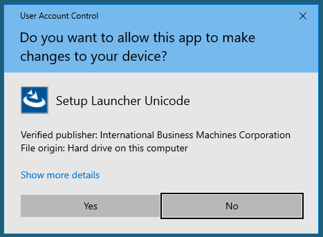 Follow the instructions on the screen, and if this is a new installation you maybe need to install a few requirements.

    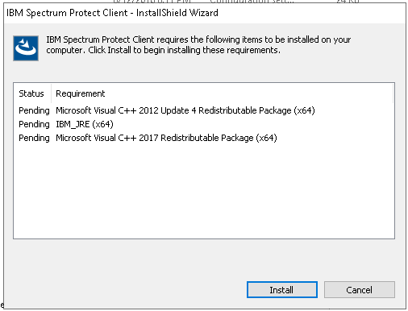

    1. The installation process could sometimes require a reboot, due to the installation of a couple of VC redistributables.
    1. If a reboot is unpleasant, at the above decision point, jump to the _"Circumvent reboot during install"_ section below.
    1. Resume the installation, choose Typical installation.
    1. After installation, answer 'No' to the reboot question.

#### Install Safespring Root Certificate

1. In a command prompt with elevated privileges, execute the "Safespring Root CA installer" to install the Safespring BaaS CA into the GSK (IBM crypto kit) trust database.
    ```
    SafeDC-Net-Root-CA-tsm12-win64.bat
    ```
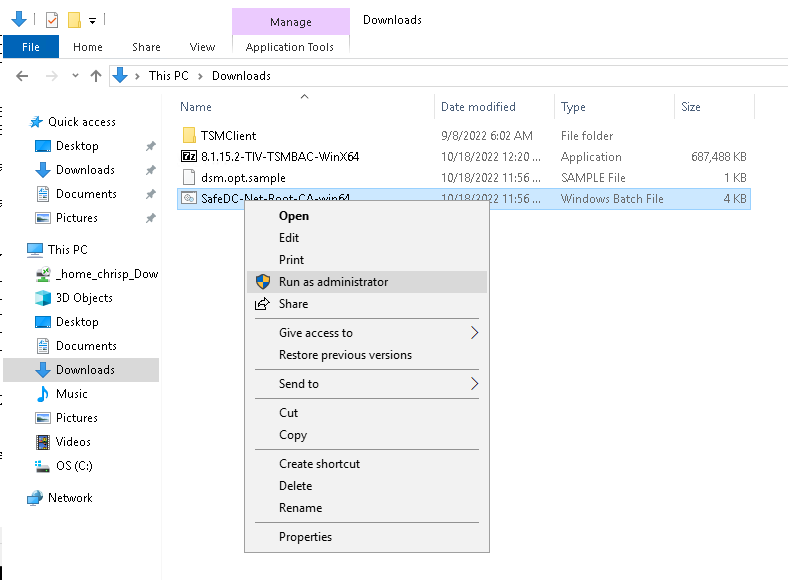

#### Create Configuration File

1. Retrieve client node configuration and password from the [Safespring Backup Portal](baas-portal), and edit the `dsm.opt.sample`, copy the *Setup Information* from the portal and past it in to `dsm.opt.sample` file and save that file in `C:\Program Files\Tivoli\TSM\baclient`


Paste the information to the `dsm.opt.sample` file between the `*** Copy and Paste Information from Safespring Backup Portal ***` sections

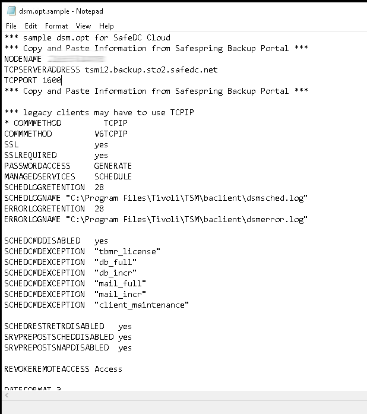

Save the file as `dsm.opt` in the Backup-Archive Directory e.g `C:\Program Files\Tivoli\TSM\Baclient\dsm.opt`
    
1. To test the connection, easiest way is either via GUI or CLI.
    1. **Login via Command-Line**
    Start a Command-Line window in *Administrator Mode* and change to the Backup-Archive Client directory e.g `cd C:\Program Files\Tivoli\TSM\Baclient` 
    Start the `dsmc.exe` and it will now ask you to confirm the *User ID* that is the same as your node name, and copy and paste the password from the [Safespring Backup Portal](baas-portal)
    
     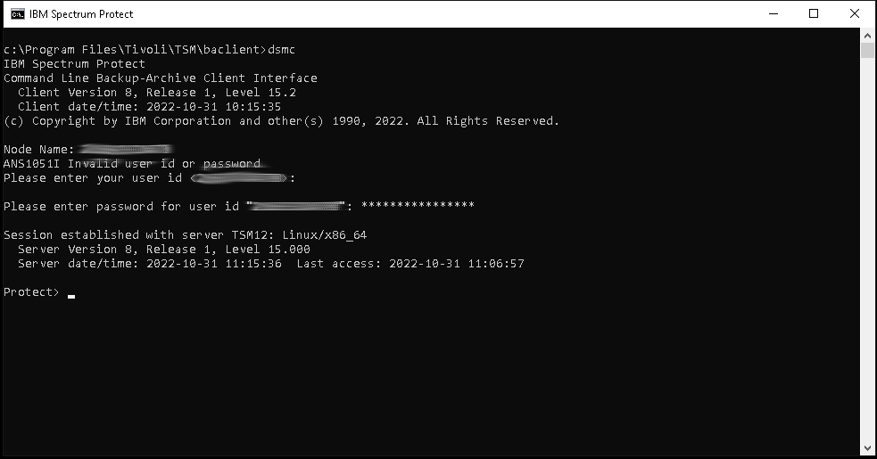

    1. **Login via GUI**
    The GUI icon can you find in the start-menu, search for Backup-Archive GUI 
    
    

    When the Backup-Archive GUI Starts it will ask for Node Admin ID and Password.
    This can be copy and pasted from the the [Safespring Backup Portal](baas-portal) and paste it to the Password feild.

     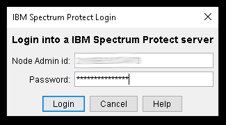

    If the application starts it was succesfully login and saved the password encrypted for future use.

#### Schedule Daily Backups

1. IBM Spectrum Protect Backup-Archive Client are polling the backup server on regular basis to see when it will backup your data next time.
To assign a predefined schedule, open [Safespring Backup Portal](baas-portal) and go to the *consumption unit* you want to define an schedule too and click on *schedule* 
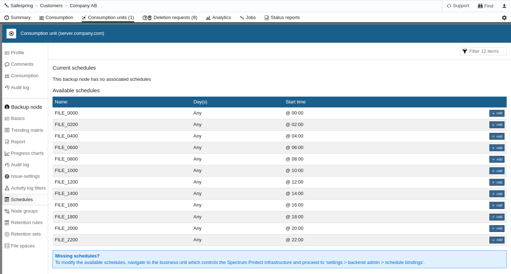

Here can you schedule the backup for your consumption unit.

1. Setup IBM Spectrum Protect Backup-Archive Client schedule polling.
    1. **Setup schedule via Command-Line**
     Start a Command-Line window in *Administrator Mode* and change to the Backup-Archive Client directory e.g `cd C:\Program Files\Tivoli\TSM\Baclient`.
     Run following commands to setup your schedule.
     ```
    dsmcutil install scheduler /name:"TSM Client Scheduler" /node:<NODENAME> /optfile:"<PATH TO DSM.OPT>" /password:<TSM PASSWORD> /autostart:no /startnow:no
    
    dsmcutil install cad /name:"TSM Client Acceptor" /node:<NODENAME> /password:<TSM PASSWORD> /optfile:"<PATH TO DSM.OPT>" /autostart:yes /startnow:no
    
    dsmcutil update cad /name:"TSM Client Acceptor" /cadschedname:"TSM Client Scheduler"

    net start "TSM Client Acceptor"
     ```

    1. **Setup schedule via GUI**
    The GUI icon can you find in the start-menu, search for Backup-Archive GUI 
    
    

    Click on *Utilities -> Setup Wizard* to start the Configuraton Wizard.

    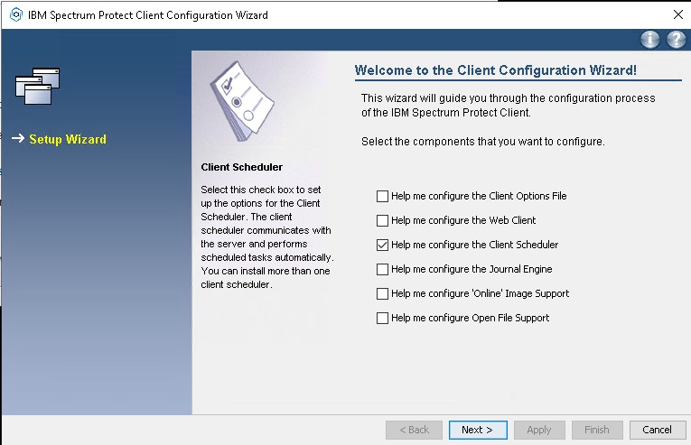

    A wizard will help you to go though step-by-step to setup the schedule.

    

    Confirm that you want to *Install a new or additional scheduler*, if *Update ...* and *Remove ...* is enables, that means you already have a earlier Spectrum Protect Schedule configured. 

    

    Make sure you enable *[X] Use the client acceptor to manage the scheduler* 

    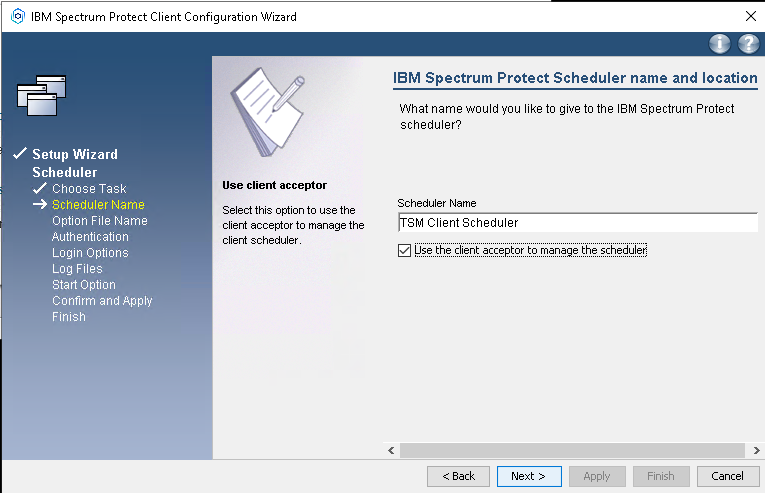

    Confirm the name of the *TSM Client Acceptor* and press *Next*

    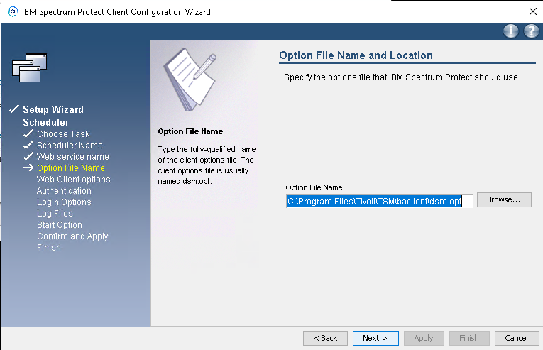

    Confirm the Client Acceptor TCP Port, this port doesn't need to be expose externally.

    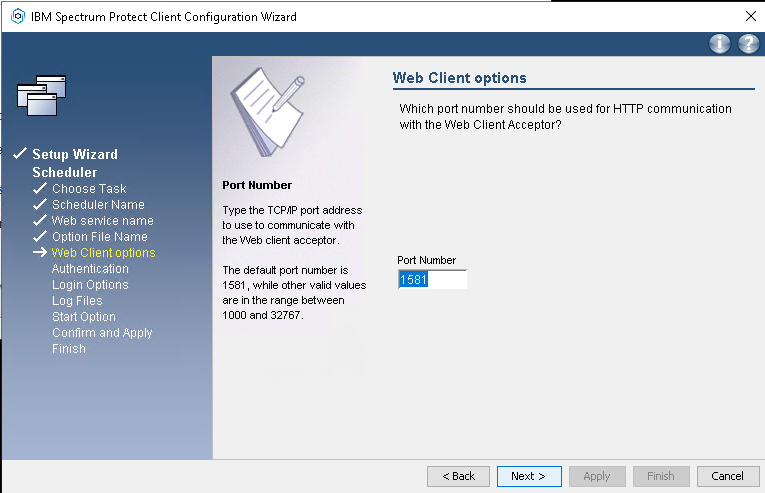

    Insert the node password, the password can be copy from the [Safespring Backup Portal](baas-portal).

    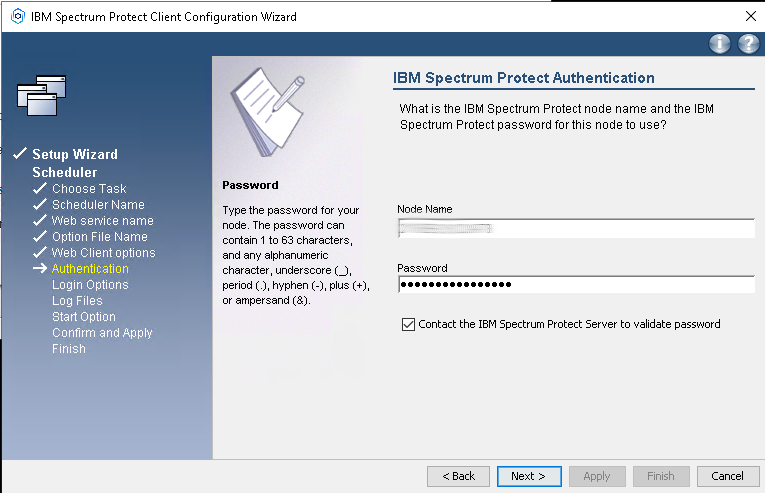

    Click on *(o) Automatic when Windows boots* to automatic start the TSM Client Acceptor Services

    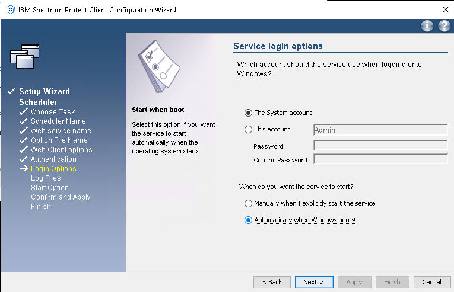

    Confirm the location where you want to save the TSM Schedule and Error Logs, and it you want to log to Windows Event Logger

    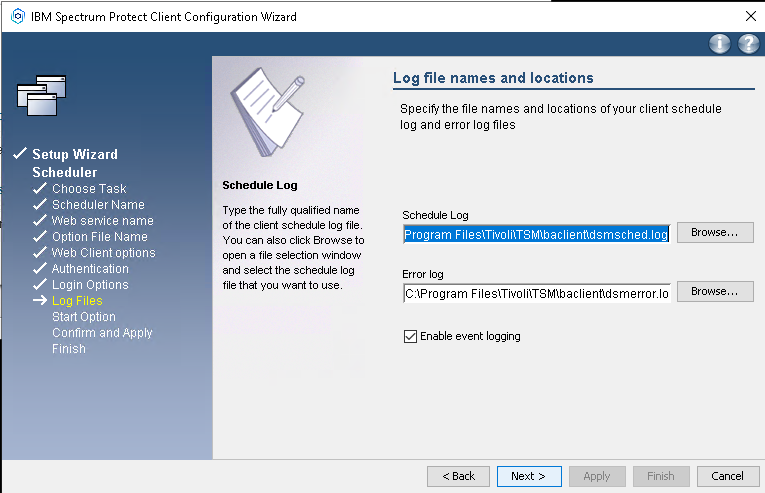

    Click on *(o) Yes* to start the TSM Client Acceptor when the wizard are done.

    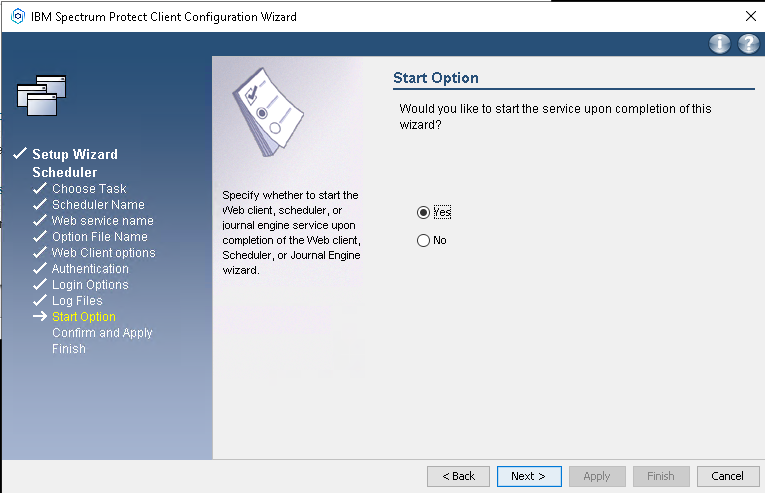

    Confirm the configuration before Setup Wizard will create the services.

    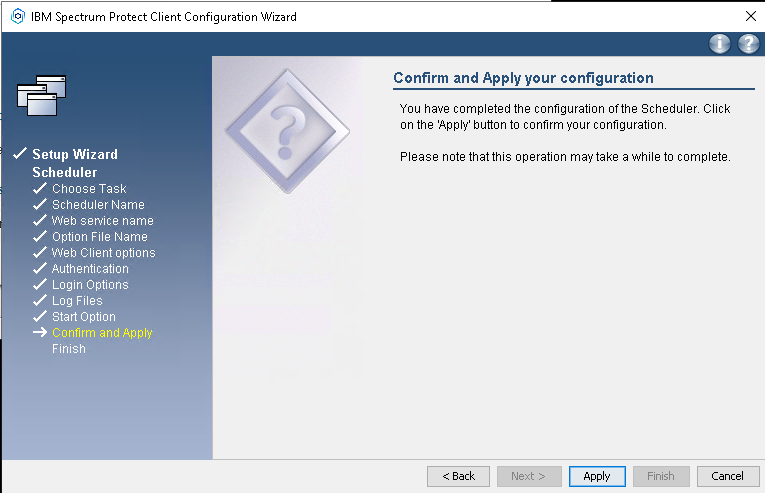

    The Configuration are now done, click *Finish* to quit the wizard.

    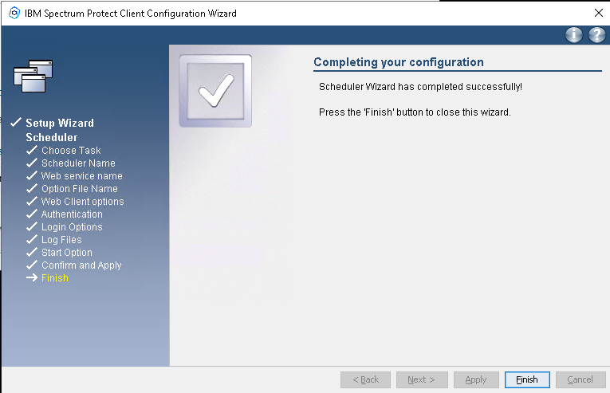

### Finish
Basic installation for Backup-Archive Client is now finish, if you need to setup a Online agent for e.g Microsoft SQL, Orable Database or any other application, you can continue with that installation.


[baas-portal]:https://portal.backup.sto2.safedc.net/
[windows-ca-installer]:https://raw.githubusercontent.com/safespring/cloud-BaaS/master/pki/SafeDC-Net-Root-CA-win64.bat
[windows-dsm-opt]:https://raw.githubusercontent.com/safespring/cloud-BaaS/master/windows/dsm.opt.sample