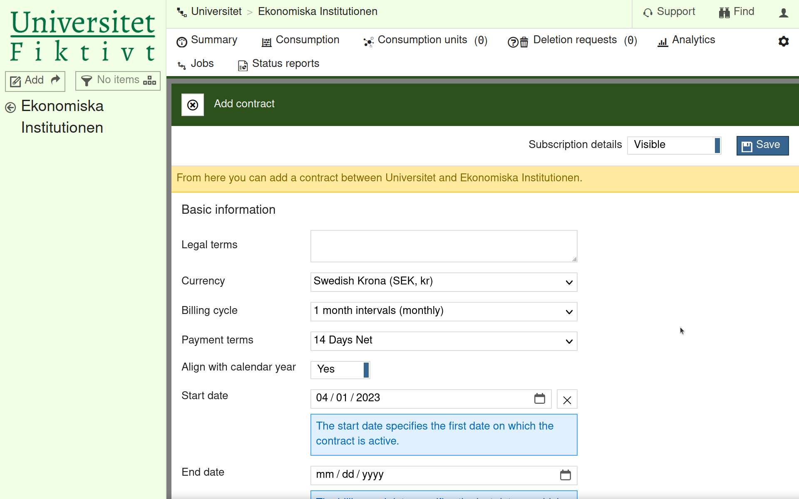
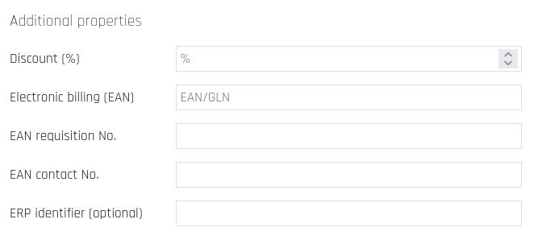
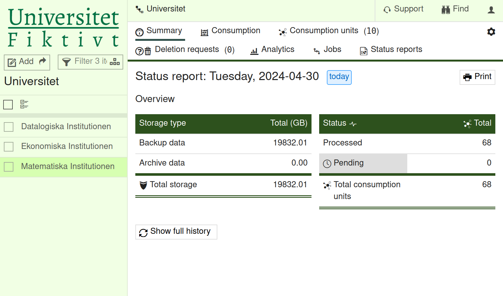
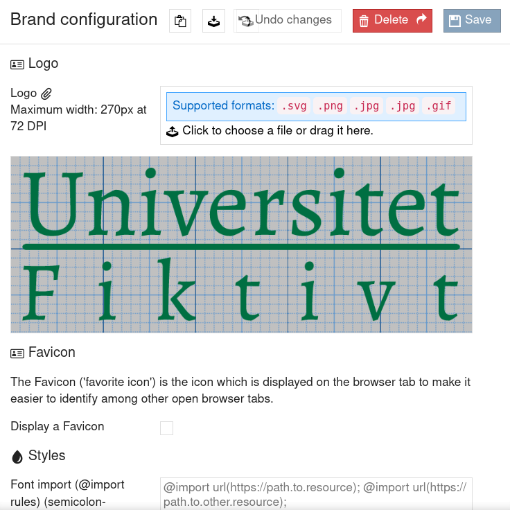

Business Units
================
If you need to organize your backups for different parts of your organization, 
you can add _business units_ underneath your organization in Cloutility.

In the figure above, "Business Unit" has been added under the fictive company 
"Your Company AB". 
Adding business units can be done by clicking the Add-button in the top-left 
corner. 
Then you can click on the newly added business unit in the left panel to 
perform operations under this unit. 

You may even add business units underneath other business units 
if you need a deeper hierarchy. 
Try this out by clicking on Add in the top-left corner to add a new business 
unit. 
Set a name for the unit, and optionally an organization number and 
timezone. 
Once it has been added, click on it on the left panel. 
Thereafter, you will be operating in the context of the business unit.

Access Control
----------------
A reason why one would want to declare a hierarchy of business units in 
Cloutility is the ability to limit access for units in the organization. You 
can create new user accounts underneath these units, as well as 
assign new roles. These users may then access consumption units _only_ within 
their respective business units.

Click on the cogwheel in the top-right corner, and then on Users. 
Here you may add new user accounts that are limited only to this particular 
unit.

Billing & Separation of Consumption
-------------------------------------
If you are dealing with several economic units that do their own accounting 
separately from each other, 
you can add Business Units to separate the consumption of backup services 
between them. 
Furthermore, a parent business unit can be declared as a reseller of backup 
services to child business units. 
A contractual agreement can be established between the parent and its children 
which allows the parent to specify how the children are charged. 
This allows Cloutility to calculate billing data that can then be used to 
generate invoices.
It is possible to upload said invoices as PDF files so that the users under the
child business unit have access to them via Cloutility.

### Backup service contracts
You can view your own business unit's contract by visiting 
**Settings -> Contract**.

To define a contract between your business unit and one of its children, 
navigate to the child, and then go to **Settings -> Contract** from there. 
It will look something like this:

### Invoicing software integration

There are options to also assign electronic billing codes to subscriptions, 
allowing you to integrate the billing data from Cloutility with invoicing 
software.

These codes can be specified from the contract page, 
at **[Child Business Unit] -> Settings -> Contract**. 
They can also be associated with specific Payment Terms
at **[Parent Business Unit] -> Settings -> Payment Terms**.
A payment term tells us the maximum amount of time that a payment has to be 
made since the invoice date, for example, 30 days.

Cloutility is fully [API-driven](../automation/rest-api.md), so this information
can be used by scripts together with an invoicing system to automate invoice creation.

Branding
-----------
A neat feature is that every business unit can have its own branding.

Above, we have an example of a fictive university with a nice green theme. 
An administrator can change their business unit's color palette and logo by visiting **Settings -> Identity -> Branding**. 

In our example, 
backup administrators to a child business unit 
(such as Datalogiska Institutionen) underneath the university can do exactly 
the same thing within their unit.