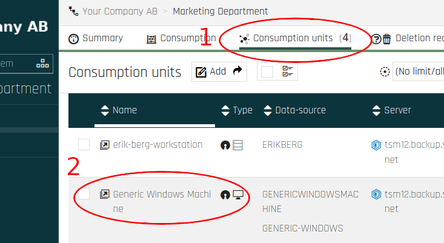
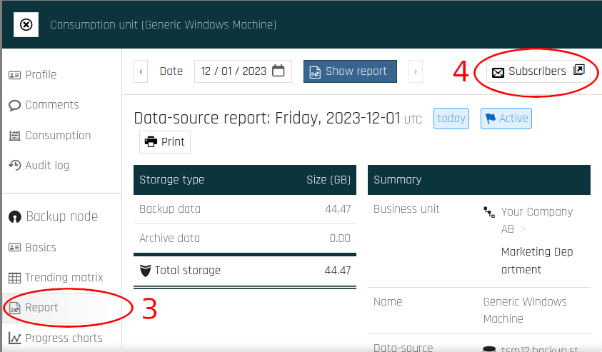
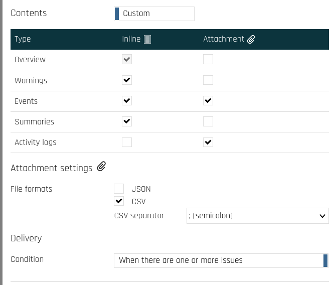
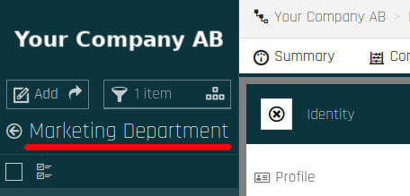
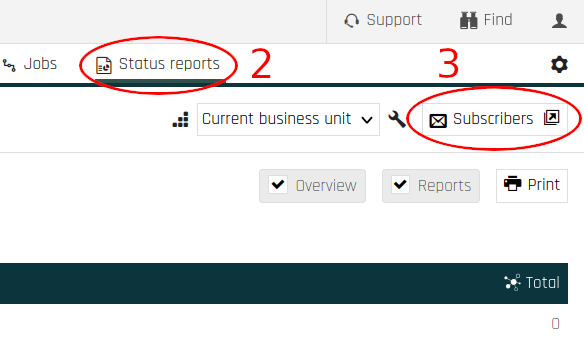
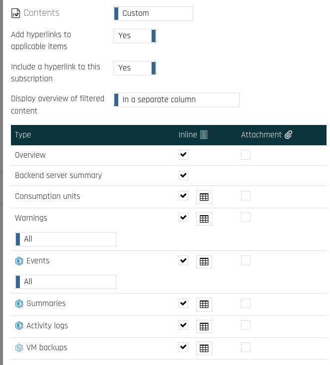
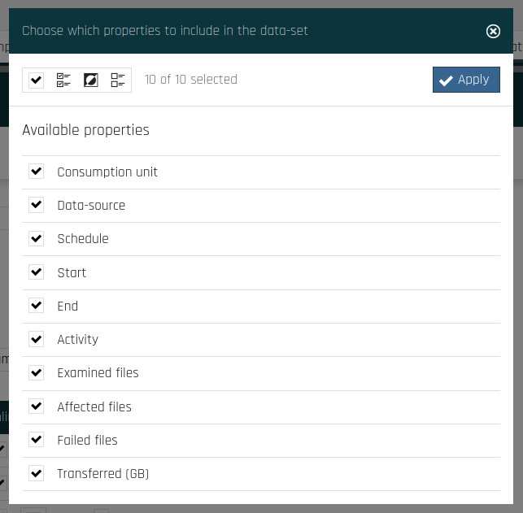

Receive Backup Reports via Email
========================

You can subscribe to receive reports about single backup nodes or entire business units routinely via email, using Cloutility.

The Data
----------
The reports can include the following information:

- Total storage used (GB)
- Backup data (GB)
- Archived data (GB)
- Transferred data (GB)
- Errors
- Warnings
- Activity logs 
    - Backup node
    - Time
    - Message
    - Message number
    - Severity
- Activities 
    - Backup node
    - Start time
    - End time
    - Activity type (e.g., backup)
    - Examined files
    - Affected files
    - Failed files
    - Transferred (GB)

The data set can be reduced or expanded based on your subscription settings.

How to Subscribe (Backup Node Reports)
------------------

To add new subscriptions and manage existing subscriptions for backup nodes:

1. Click on **Consumption Units** on the top menu.
2. Click on the backup node you would like to manage subscriptions for.
      
3. Click on **Report** on the side menu.
4. Click on **Subscribers**.
      

To add a new subscription, click on **Add**.

### Recipients
The minimum requirement for a subscription is that you specify at least one recipient address by adding "Email Recipients."

Optionally, you can give the report a name and choose if its recipients should see each others email addresses on the email report (Send mails as **To**) or not (Send mails as **Bcc**).

### Contents

By default, the data set options are _inherited_. To customize which data to include in the report, switch from **Inherited** to **Custom**.

**Inline** means that the content will appear in the message body, while **Attachment** means that it will be included as an attachment. If you choose to receive data as attachments, you will be able to set additional options specifying how these files should be formatted.

Furthermore, you can set a **Condition** for sending reports. You have two options, send a report:

1. When there are one or more issues
2. Every day/always (even when there are no issues)

### Formatting

The following formatting settings for dates and numbers can be set:

- Decimal mark (comma or period)
- Date format
- Time format

###  Data-source status settings

Lastly, there are options to specify which events, activities or non-activities should be warned about or considered to be errors. 

Just like with the Contents settings, these options are initially inherited. To modify them, switch from **Inherited** to **Custom**.

This section allows you to make the report highlight what has happened (or not) as problematic based on your requirements.

!!! note

    Only the general settings and the "Storage Protect" settings are relevant. You may safely ignore all options under "Storage Protect _Plus_" and "Rubrik" at the bottom.

How to Subscribe (Business Unit Reports)
------------------

Adding new and managing existing subscriptions for entire business units is done in a very similar way to that of single Backup Nodes.

1. Make sure that you are operating under the desired Business Unit. The current Business Unit is shown in the top-left corner, as highlighted in the image.
      
2. Click on **Status reports** on the top menu.
3. Click on **Subscribers**.
      

To add a new subscription, click on **Add**.

### Recipients
The minimum requirement for a subscription is that you specify at least one recipient address by adding "Email Recipients."

Optionally, you can give the report a name and choose if its recipients should see each others email addresses on the email report (Send mails as **To**) or not (Send mails as **Bcc**).

### Contents
By default, the data set options are _inherited_. To customize which data to include in the report, switch from **Inherited** to **Custom**.

**Inline** means that the content will appear in the message body, while **Attachment** means that it will be included as an attachment. If you choose to receive data as attachments, you will be able to set additional options specifying how these files should be formatted.

The button that appears next to some of the inline-checkboxes opens a dialog that gives you more fine-grained options for what to include for each content type.

#### Grouping

There are options for how to group consumption unit information. You can either group by node **Platform** or **Type**.

To take into consideration whether [Node Replication](https://www.ibm.com/docs/en/storage-protect/8.1.24?topic=commands-query-node-query-nodes#r_cmd_node_query__ndq_fielddesc__title__1) is activated while grouping, you can check the **Replication Mode** option for each respective node type.

!!! note
      Ignore the options for "IBM Spectrum Protect _Plus_" and "Rubrik".

### Frequency

To schedule reports, change the frequency from **On Demand** to **Daily**, **Weekly** or **Monthly**. 
More options will appear when you do so.

### Formatting

The following formatting settings for dates and numbers can be set:

- Decimal mark (comma or period)
- Date format
- Time format

### Incident emails

You can specify a list of emails/subscribers that will receive incident reports for each node that has any of the statuses checked under **Filters**. Furthermore, you have a lot of control over how these messages should be formatted. By adding an **Email recipient**, options for how the message subject and body should look will appear.

### Data-source status settings

This section is identical to when you design reports for individual nodes. For more information, see [Data-source status settings](#data-source).