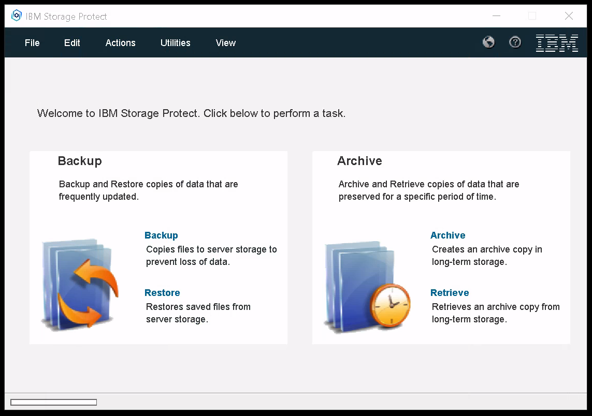
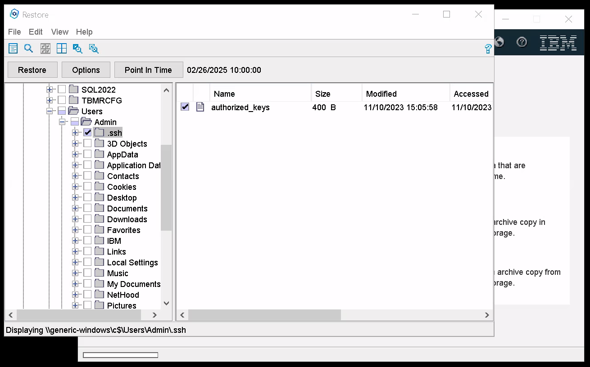
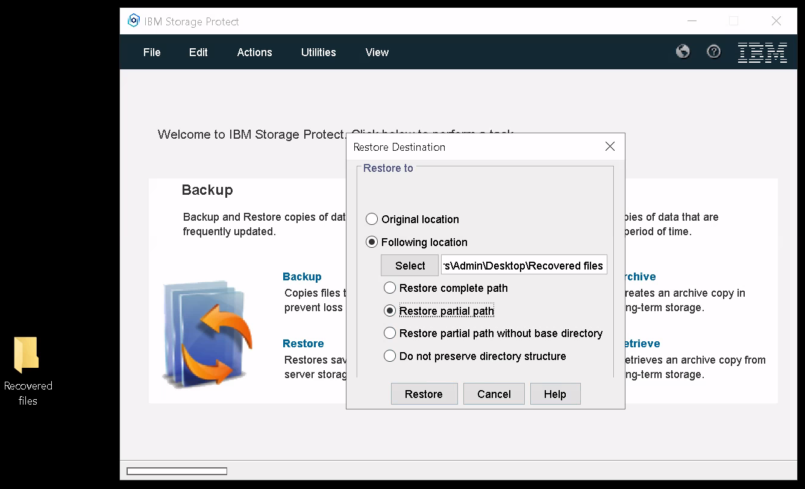
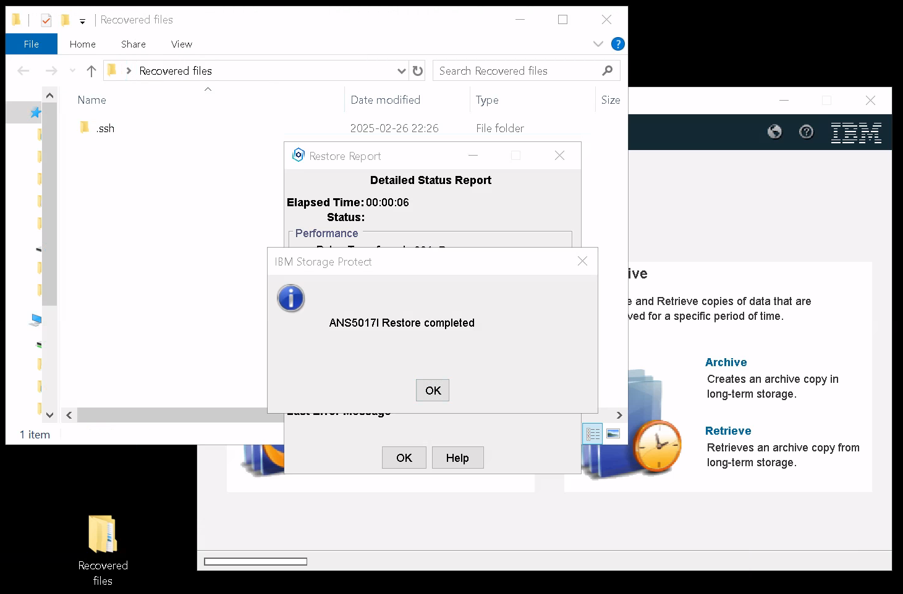

How to Restore Files
=====================
This article explains how to restore previously backed-up files.

What has been backed up?
-------------------------
First, it can be helpful to get an idea of which files you have backed up, and 
that have not been expired yet.
To learn how to do this, visit [HOWTOs/List Files](../howto/list-files.md).

Where can I restore my data to?
---------
Restoring data from a backup node belonging to a machine of the same operating 
system as the restoring machine is always supported.

Restoring data from one operating system to another is **not supported** 
(e.g. Linux data to macOS, or Windows data to Linux).

Restore on Windows
-------------------
On Windows, the easiest way to restore files is using the graphical application.

1. Open the **Backup-Archive GUI** application.
2. Click on **Restore**.

    

3. Click on **Point In Time**, then tick the checkbox 
   **Use a Point in Time date during the restore** 
   and select the date you wish to restore from. 
   Once done, click **Ok**.
   
    

4. In the file tree to the left, find the old folder(s) you wish to restore and 
   tick the checkbox(es) next to it/them.

    

5. Click on the **Restore** button.
6. Click on **Following location** and select an empty folder to restore the 
   old folder to. 
   If you don't have one, you can just create an empty folder on 
   your Desktop. 
   Leave the **Restore partial path** option checked. 
   Once done, click **Restore**.

    

7. Once the restoration is complete, your old folder should be inside the 
   previously empty folder you selected on step 6.

    

Restore on Linux
-----------------
Restoring files is done using the `dsmc restore` command.

A complete example:
```
dsmc restore -preservepath=complete -subdir=yes -replace=yes \
    -dateformat=3 -pitdate=2024-09-13 -pittime=08:00:00 \
    '{/the/filespace}/subdir/' '/'
```

!!! Warning 
      `-replace=yes` will cause conflicting files on the destination to be 
      replaced automatically. 
      Remove this option if you want to manually decide for every file what 
      to replace or not.

### Explanation
The invocation above restores all files under '/the/filespace/subdir/' from 
2024-09-13 08:00:00 to the same location on the current system.

Options:

- **-preservepath=complete**: Preserve the complete path when restoring to the
  destination (which is the root directory `/`). For example, the file 
  `/the/filespace/subdir/a/b.txt` will be restored to 
  `/the/filespace/subdir/a/b.txt` on the current system. If we omit this flag,
  dsmc will default to `preservepath=subtree`, this will instead cause the
  aforementioned file to be restored to `/subdir/a/b.txt`. This may or may not 
  cause unwanted conflicts, depending on the destination. (<a href="https://www.ibm.com/docs/en/storage-protect/8.1.26?topic=reference-preservepath" target="_blank">docs</a>)
- **-subdir=yes**: Restore files in subdirectories, recursively. 
  Without this option, dsmc will only restore direct descendants of the 
  specified source directory. (<a href="https://www.ibm.com/docs/en/storage-protect/8.1.26?topic=reference-subdir" target="_blank">docs</a>)
- **-replace=yes**: On conflict, automatically replace the current file on the 
  system. (<a href="https://www.ibm.com/docs/en/storage-protect/8.1.26?topic=reference-replace" target="_blank">docs</a>)
- **-dateformat=3**: Set the date format to YYYY-MM-DD 
  (for the `pitdate` option). The default can vary depending on the system 
  locale. (<a href="https://www.ibm.com/docs/en/storage-protect/8.1.26?topic=reference-dateformat" target="_blank">docs</a>)
- **-pitdate**: Point-In-Time (PIT) date of the backed-up files to restore. 
  (<a href="https://www.ibm.com/docs/en/storage-protect/8.1.26?topic=reference-pitdate" target="_blank">docs</a>)
- **-pittime**: Point-In-Time (PIT) time of the backed-up files to restore.
  (<a href="https://www.ibm.com/docs/en/storage-protect/8.1.26?topic=reference-pittime" target="_blank">docs</a>)

Positional arguments:

- `'{/the/filespace}/subdir/'`: The source path of the directory to restore.
  `/the/filespace` is the filespace. You may omit `{}` if you do not fear
  any ambiguity, by instead writing `'/the/filespace/subdir/'`.
- `'/'`: The destination to where restored files and directories should end up.

More information can be found <a href="https://www.ibm.com/docs/en/storage-protect/8.1.26?topic=uc-restore" target="_blank">here</a>.

More examples
---------------

Restore **a single file** to the current working directory:
```
dsmc restore '/root/.ssh/authorized_keys' './'
```

Restore **a directory** and only its immediate descendants to the current 
working directory:
```
dsmc restore '/home/ubuntu/' './'
```

Fully restore **a directory** to the current working directory:
```
dsmc restore -subdir=yes '/home/ubuntu/' './'
```

Restore **a directory** without its content to the current working directory 
(almost equivalent to `mkdir ubuntu`):
```
dsmc restore '/home/ubuntu' './'
```

Cancel restore session
-----------------------
It may happen that a restore session which you do not have access to is 
active. This will prevent you from restoring files from the node, and an 
invocation to `dsmc restore` will output the following:
```
...
Restore function invoked.

ANS1247I Waiting for files from the server...
                                  
>>>>>> Restore Processing Interrupted!! <<<<<<
ANS1330S This node currently has a pending restartable restore session.

The requested operation cannot complete until this session either
completes or is canceled.
```
If you feel that it is safe, you can cancel it by invoking:
```
dsmc cancel restore
```
