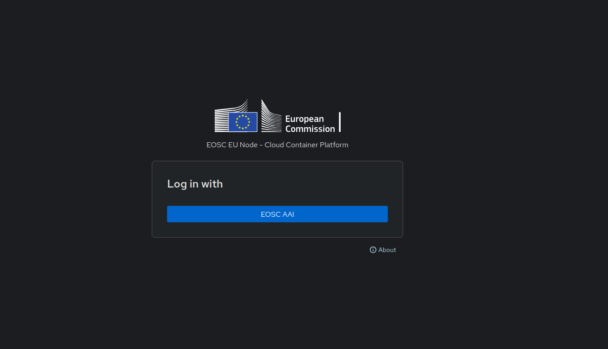
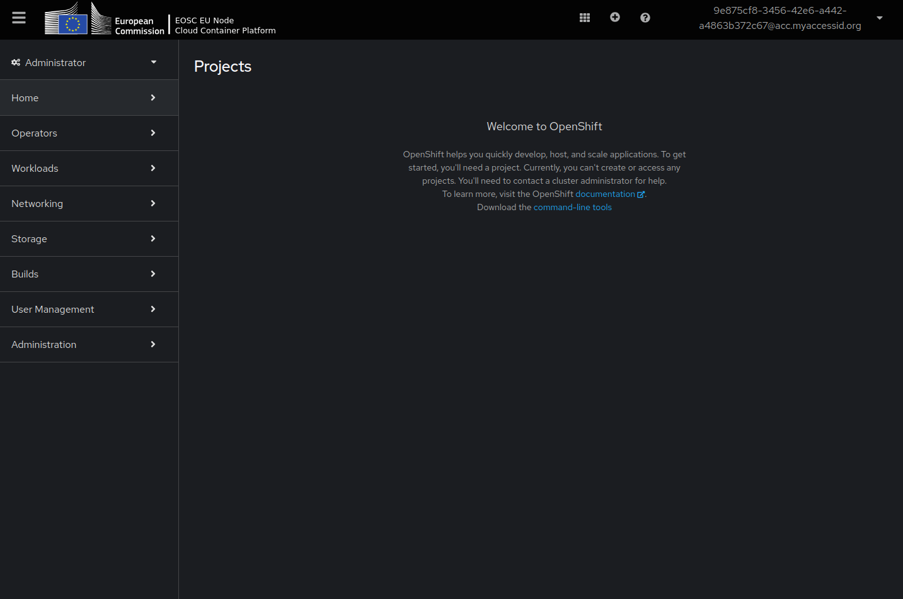

# Overview

A managed platform that allows you to develop and deploy applications using your preferred programming languages, versions, and frameworks—on demand.

- Set Up a Development Environment in Minutes
- Wide Selection of Languages, Tools, and Frameworks
- Centrally Managed Infrastructure

For this iteration of the Container Platform we are making use of [OpenShift Kubernetes Distribution (OKD)](https://okd.io/) Which integrates integrates [Kubernetes with additional tools and features](getting-started.md#core-concepts) to facilitate the development, deployment, and management of applications.

### What is OKD?

OKD is a Kubernetes distribution optimized for continuous application development, enabling rapid deployment and easy scaling. It is ideal for:

- Hosting interactive web applications or regular websites.
- Pre-packaging complex applications like Apache Spark, making it easy for others to deploy their own instances.
- Deploying web applications written in common languages like Python, JavaScript, or Java with a single command.
- Running web applications or hosting websites, offering many of the essential features needed for web-based applications.

Current OKD version: 4.15 / Kubernetes version: 1.28

## Accessing the Container Platform

There are three main interfaces to interact with Container Platform:

- Web console - [OKD 4 docs](https://docs.okd.io/4.15/web_console/web-console-overview.html);
- Command line (`oc`; or `kubectl` as fallback) - follow [CLI tools](https://docs.redhat.com/en/documentation/openshift_container_platform/4.15/html-single/cli_tools/index) for installing `oc` command. For installing `kubectl` command follow [kubernetes instal tools](https://kubernetes.io/docs/tasks/tools/);
- API - for using different programming languages follow [REST API](https://docs.okd.io/4.15/rest_api/index.html).

### Web Console

To login into the Container Platform Web console use the appropriate URL (e.g. EOSC https://eu-2.paas.open-science-cloud.ec.europa.eu/ ) and select login method `EOSC AAI`, which will redirect you to select the login provider. Once login has been successful you will be able to see the OKD Web Console.



All applications launched in the Container Platform will run within `projects` that have been requested by each user in the European Open Science Cloud. Each project has its own private virtual network and it is isolated from other projects. Users can only see projects they have access to.



### Command line

```bash
oc login <api_url> -u=<username> # cli will interactively ask for password
# or
oc login <api_url> -u=<username> -p=<password>
 
# for example EOSC production
oc login --server=https://api.eu-2.paas.open-science-cloud.ec.europa.eu:6443
```

To obtain the login access token go to the Web console and under the User menu (top right corner) see the `Copy login command` and follow the instructions


```bash
# for example EOSC production login using token 
oc login --server=https://api.eu-2.paas.open-science-cloud.ec.europa.eu:6443 --token=<access-token>
```

### EOSC users

EOSC users can use the Production Cluster with the following endpoints:

|                        | URL                                                        |
|------------------------|------------------------------------------------------------|
| Web console            | https://eu-2.paas.open-science-cloud.ec.europa.eu/         |
| API address            | https://api.eu-2.paas.open-science-cloud.ec.europa.eu:6443 |
| Default routes address | `*.eu-2.open-science-cloud-user-apps.eu`                   |
| Image registry         | https://registry.apps.okd-eosc.staging.safedc.services/    |

!!! note
    For Accessing the staging environment to test specific features in an isolated environment please contact support@safespring.com or official European Open Science Cloud help desk.


## What to do next ?

- [Getting Started](getting-started.md)
- [Projects](projects.md)
- [Routes and Networking](networking.md)
- [Persistent Volumes](persistent-volume.md)
- [Container Registry](registry.md)
- [FAQ](faq.md)