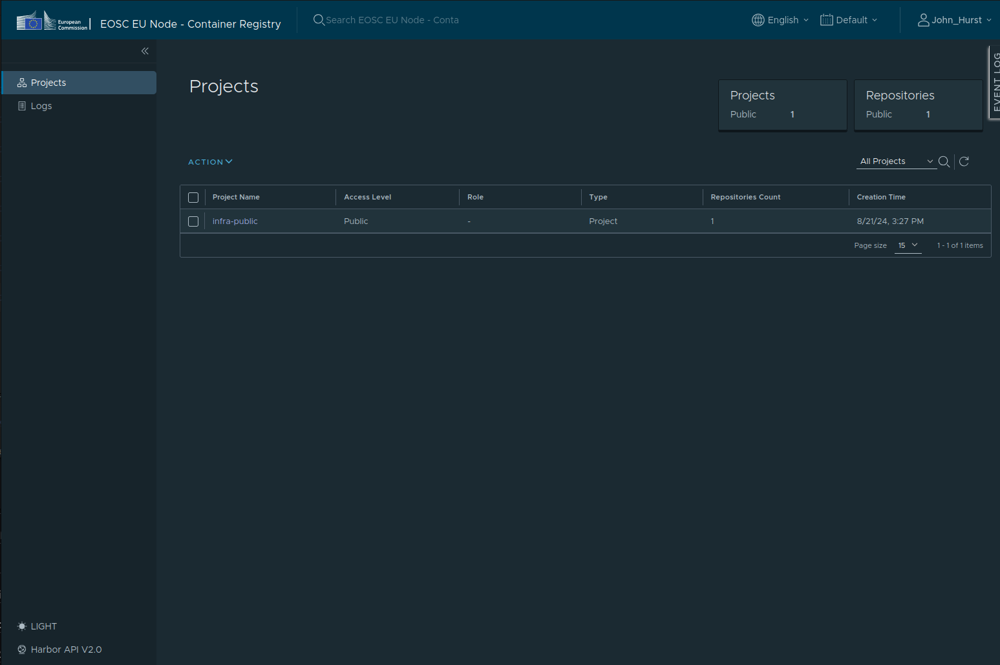
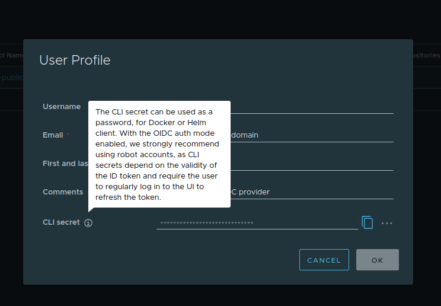

# Registry Overview

In the dashboard, you can view all your resources. To maximize its utility, populate the registry with container images.

Key features include:

- Pushing, pulling, storing, scanning, and managing container images compatible with Docker.
- Pushing, pulling, and deploying Helm charts.
- Scanning images for vulnerabilities.

The registry organizes images and Helm charts into projects. You can access **Projects** from the left-hand menu.



## Working with Container Images

**What is a container?**

A container is like a "black box" that encapsulates your application and all its dependencies. It can be configured through environment variables, command line arguments, or injected configuration files. Learn more here: [What is a container?](https://developers.redhat.com/blog/2018/02/22/container-terminology-practical-introduction#basic_vocabulary)

**How do I package my app into a container?**

Typically, you create a `Dockerfile` (or [`Containerfile`](https://manpages.debian.org/experimental/golang-github-containers-common/Containerfile.5.en.html)) that specifies the necessary system libraries, files, and configurations. For a quick start, check out: [Podman Getting Started](https://podman.io/get-started).

### Obtaining Credentials

To obtain a CLI login token, go to the `User Profile` in the top right corner after logging in, and retrieve a CLI secret valid for the session. Once the session expires, you can obtain a new token.



!!! note
    To obtain a robot account, please contact support@safespring.com or the official European Open Science Cloud help desk.
    A robot account can be used as a registry secret in your application. See [Creating a Registry Secret](https://kubernetes.io/docs/tasks/configure-pod-container/pull-image-private-registry/#registry-secret-existing-credentials).

### OKD Container Image Requirements

OKD is a secure-by-default cluster, which means additional security constraints are enabled:

- Each project has a range of UIDs, and each Pod runs with a random UID from that range. This might cause permission errors if not set correctly in the image files. Ports below 1024 cannot be opened by the Pod.
- It’s recommended to use higher ports and adjust permissions within the container. Note that mounted PVCs always have the correct permissions.

For more information:

- [OKD Guidelines](https://docs.okd.io/4.15/openshift_images/create-images.html#images-create-guide-openshift_create-images)
- [Support Arbitrary User IDs](https://docs.okd.io/4.15/openshift_images/create-images.html#use-uid_create-images)

Common adjustments for images running on OpenShift include:

- Avoiding privileged ports (below `1024`).
- Adding write access to certain directories for `gid=0`, e.g., `RUN chgrp -R 0 /some/directory && chmod -R g+rwX /some/directory`.

### Creating a Container Image

Start by creating a container image. In this tutorial, you’ll create a simple image that includes NGINX and a basic website.

The following steps can be executed on your local workstation. Ensure you have a tool installed to create container images:

- For Docker, review the [official instructions](https://docs.docker.com/engine/install/).
- For Podman, review the [official instructions](https://podman.io/docs/installation).

!!! info "Podman"
    In these examples, we use `podman`, but the commands are interchangeable with `docker`.

### Pushing Images to the Registry

Once your container image is ready, you can push it to your Container Registry using CLI tools:

1. Log in to the registry from the CLI since the project is private:

    ```bash
    podman login registry.eu-2.paas.open-science-cloud.ec.europa.eu
    ```

    Enter your username and password. Use the `admin` credentials you set up when you first logged in to the Container Registry interface.

2. Tag your container image. The example below tags the image with version `1.0.0` for the project in the  registry:

    ```bash
    podman pull docker.io/bitnami/nginx
    podman tag docker.io/bitnami/nginx \
        registry.eu-2.paas.open-science-cloud.ec.europa.eu/<project_name>/example-nginx-image:1.0.0
    ```

3. Push the container image to the registry:

    ```bash
    podman push \
        registry.eu-2.paas.open-science-cloud.ec.europa.eu/<project_name>/example-nginx-image:1.0.0
    ```

You can verify the results in the Registry dashboard by navigating to the **Projects** page via the left-hand menu and selecting the **library** project. Your image should be listed there.

### Docker Hub Proxy

In order to address the rate limiting imposed by Docker hub registry we provide a proxy available for internal use within the Container platform. This can be utilised by prefixing your images with the `registry.eu-2.paas.open-science-cloud.ec.europa.eu/base`, for example instead of `bitnami/redis` or `docker.io/bitnami/redis`, use image `registry.eu-2.paas.open-science-cloud.ec.europa.eu/base/bitnami/redis`.

## Working with Helm Charts

!!! info "Helm"
    Helm is a CLI tool which enables developers to create declarative and configurable application/service definitions for Kubernetes/OpenShift named charts. Each chart is configurable and produces Kubernetes/OpenShift resources in the process (which describe the application).

    See more at: https://helm.sh/

Package your Helm chart into a `.tgz` file:

```bash
# Navigate to your local charts directory
helm package .
# This will create a .tgz file with the chart version, e.g., myapp-0.1.0.tgz
```

Upload the Helm chart using the following command:

```bash
helm registry login registry.eu-2.paas.open-science-cloud.ec.europa.eu
helm push myapp-0.1.0.tgz \
    oci://https://registry.eu-2.paas.open-science-cloud.ec.europa.eu/<project_name>/myapp
```

To deploy your charts directly from the registry, use this command:

```bash
helm install myapp \
    oci://https://registry.eu-2.paas.open-science-cloud.ec.europa.eu/<project_name>/myapp \
    --version 0.1.0
```

## Known Issues

There is a know bug in the Container Registry, identified in the underlying application [Harbor](), that causes an yellow banner to appear in the application with the message `Certain jobs have been pending for execution for over 24 hours. ...`

This is a know bug reported at: https://github.com/goharbor/harbor/issues/19923 and can be ignored